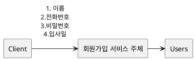
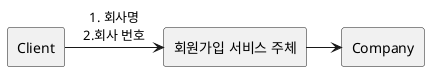

# Alter 프로젝트 클래스 다이어그램

```plantuml

@startuml
    rectangle Client
    rectangle "회원가입 서비스 주체"
    rectangle Users
    
    Client -> "회원가입 서비스 주체" : 1. 이름\n2.전화번호\n3.비밀번호\n4.입사일\n
    "회원가입 서비스 주체" -> Users
    
@enduml


```

```plantuml

    @startuml
    
    rectangle Client
    rectangle "회원가입 서비스 주체"
    rectangle Company
    
    Client -> "회원가입 서비스 주체" : 1. 회사명\n2.회사 번호
    "회원가입 서비스 주체" -> Company

    @enduml

```